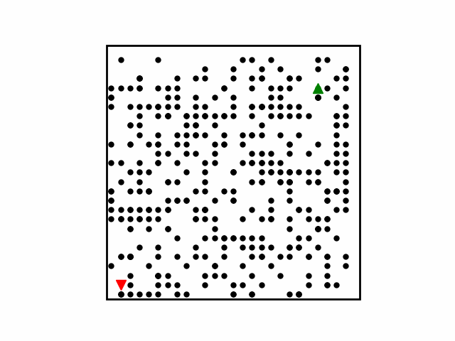

# PathPlanning-Py

Single robot path planning algorithms implemented in Python. Including heuristic search and incremental heuristic search methods.

Incremental heuristic search methods are used for **dynamic path planning** with changes in the map (environment).

## Methods

**heuristic search methods**

- A* (can turn into Dijkstra by changing the heuristic function)
- PEA*:Partial Expansion A*
- EPEA*:Enhanced Partial Expansion A*

**incremental heuristic searchs method** (For dynamic environments and moving agents)

- LPA*(Life Long Planning A*)
- D*Lite

## Simulations

<table style="padding:10px">
  <tr>
    <td></td>
    <td></td>
    <td></td>
  </tr>
</table>

## Run

- Go into the methods directory.
- Run the **RUN_[Methods_name].py** file
  - AStar/run_astar.py
  - LPAStar/run_lpastar.py
  - DStarLite/run_dstar_Lite.y

## General

Apart from each path planning method's directory, there are other general directories:

- **common**: common functionalities used in all planning methods
- ...

## Common Settings

can change this setting in setting dictionary in the run_[method].py file

- distance type: **dist_type** ('euclidean' or 'manhattan')
- distance type: **adj_t_ype** ('4adj' or '8adj')
- expansion method: **expand_method**
  - 'random': onlly based on distance cost
  - 'heading': based on distance and heading

Also, you can set **use_rnd** param:

- True: create model (obstacles and roobot arrangements) randomly
- False: create model based on predefined arrangements

to change the mode configurations (predefined arrangements), edit common/create_model_base.py

## Dependencies

- python3
- numpy
- matplotlib
