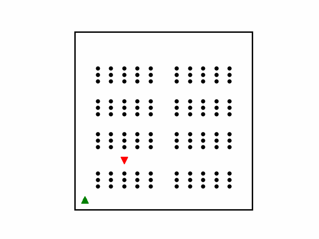

# PathPlanning-Py

Single robot path planning algorithms implemented in Python. Including heuristic search and incremental heuristic search methods.

Incremental heuristic search methods are used for **dynamic path planning** with changes in the map (environment).

<table style="padding:10px">
  <tr>
    <td></td>
    <td></td>
  </tr>
  <tr>
    <td></td>
  </tr>
</table>

## Methods

- A* (can turn into Dijkstra by changing the heuristic function)
**incremental heuristic searchs:**
- LPA*(Life Long Planning A*)
- D*Lite

## Run

- Go into the methods directory.
- Run the **RUN_[Methods_name].m** file
  - AStar/run_Astar.py
  - LPAStar/run_lpastar.py
  - DStarLite/run_dstar_Lite.y

## General

Apart from each path planning method's directory, there are other general directories:

- **common**: common functionalities used in all planning methods
- ...

## Dependencies

- python3
- numpy
- matplotlib

## Simulations
