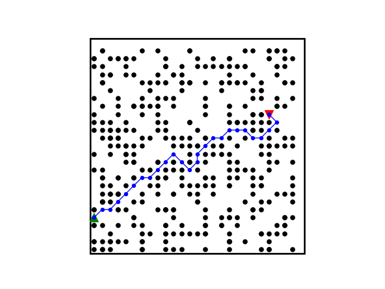
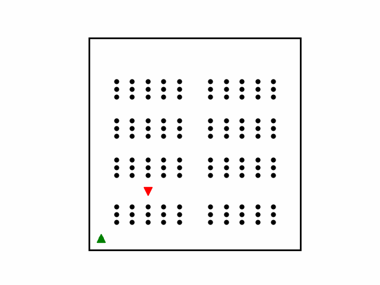

# PathPlanning-Py

Single robot path planning algorithms implemented in Python. Including heuristic search and incremental heuristic search methods.

Incremental heuristic search methods are used for **dynamic path planning** with changes in the map (environment).

## Methods

- **heuristic search methods**
  - A* (can turn into Dijkstra by changing the heuristic function)
  - PEA*:Partial Expansion A*
  - EPEA*:Enhanced Partial Expansion A*

- **incremental heuristic searchs method** (For dynamic environments and moving agents)

  - LPA*(Life Long Planning A*)
  - D*Lite

## Simulations

<table style="padding:10px">
  <tr>
    <td></td>
    <td></td>
    <td></td>
  </tr>
</table>

## Run

Run the **run_auto.py**  at methods directory

- AStar/run_astar.py
- PEAStar/run_astar.py
- EPEAStar/run_astar.py
- LPAStar/run_lpastar.py
- DStarLite/run_dstar_Lite.y

## Settings

Settings JSON file:
> zMethodHandler/Settings/settings_auto.json

Includes:

- Model settings:
  - **dist_type** : distance type('euclidean' or 'manhattan')
  - **adj_t_ype**: connection type ('4adj' or '8adj')
  - **expand_method**: expansion method:
    - 'random': onlly based on distance cost
    - 'heading': based on distance and heading

- setting_pp:
  - **map_id**: number of the map (see common/mode_inputs.py)

## Model (MAP) - Problem definition

Check out the common/model_inputs.py file to your custom model (map).
Remember to update settings_auto.json file.

## Common Directory

Includes scripts used in all path planning methods.

- create base model (map and configurations) for all methods
- Final evaluation
- Plotting
- ...

## Dependencies

- python3
- numpy
- matplotlib
